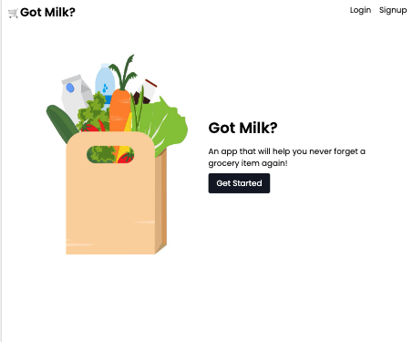

# Got Milk? Grocery List App:

## Description

Got Milk? is a full stack application that uses both front end and back end technology. It allows users to add, view, and delete their ingredient details. It has a user signup and login feature to personalize the user experience.

## Table of Contents

- [Installation](#installation)
- [Usage](#usage)
- [License](#license)
- [Contribution](#contribution)
- [Tests](#test)
- [Questions](#questions)

## Installation

This application uses `node.js` and `express.js` to create a RESTful API. It also uses `bouncerjs` as a lightweight form validation library.
 The following npm dependencies will need to be installed:  
  `bcrypt:^5.0.0`
 `connect-session-sequelize: ^7.0.4`
 `dotenv: ^8.2.0`
 `express: ^4.17.1`
 `express-handlebars: ^5.2.0`
 `express-session: ^1.17.1`
 `formbouncerjs: ^1.4.6`
 `mysql2: ^2.2.5`
 `sequelize: ^6.3.5`

## Usage

Application is deployed to [Heroku](https://got-milk-grocery.herokuapp.com/)
 

## License

  This application is licensed under [GNU](https://www.gnu.org/licenses/licenses.en.html).
  Copyright &copy; 2022 Mary Villoso, Jamie Otto, Sara Teshome, Mikell Turla

## Contribution

University of Washington coding bootcamp project contributors:
 - Mikell Turla
 - Mary Villoso
 - Jamie Otto
 - Sara Teshome

## Test

There are no tests required for this application.
  For code review go to the [Github project repo](https://github.com/teshome28sara/Got_Milk-)
 For deployed site go to the [project App](https://got-milk-grocery.herokuapp.com/)

## Questions

Feel free to contact us with any questions.
 Mary Villoso - Mcvilloso@gmail.com
 Jamie Otto - jmotto31@gmail.com
 Sara Teshome - tes28sar@gmail.com
